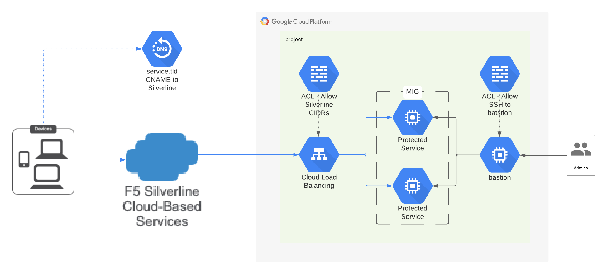

# GCP L4 Network Load Balancer for Silverline proxy

The Terraform will create a GCP L4 NLB and service MIG for testing Silverline
proxy to an exposed GCP NLB.

<!-- spell-checker: ignore bigip oslogin nics byol payg vcpus preemptible routable zoneinfo -->
<!-- markdownlint-disable MD033 MD034 -->
<!-- BEGINNING OF PRE-COMMIT-TERRAFORM DOCS HOOK -->
## Requirements

| Name | Version |
|------|---------|
| terraform | ~> 0.13.5 |
| google | ~> 3.48 |
| google | ~> 3.48 |

## Providers

| Name | Version |
|------|---------|
| google | ~> 3.48 ~> 3.48 |
| google.executor | ~> 3.48 ~> 3.48 |
| google-beta | n/a |

## Inputs

| Name | Description | Type | Default | Required |
|------|-------------|------|---------|:--------:|
| bastion\_access\_members | An optional list of users/groups/serviceAccounts that will be granted login privleges to the control-plane bastion via IAP tunnelling. Default is an empty list. | `list(string)` | `[]` | no |
| enable\_unprotected\_access | When set to true, allow ingress to backend service without proxying through Silverline. Default is false, which restricts ingress to the CIDRs associated with Silverline. | `bool` | `false` | no |
| labels | An optional map of string key:value pairs that will be applied to all resources that accept labels. Default is an empty map. | `map(string)` | `{}` | no |
| prefix | The name of the upstream client network to create; default is 'client'. | `string` | n/a | yes |
| project\_id | The existing project id that will host the resources. E.g. project\_id = "example-project-id" | `string` | n/a | yes |
| region | The GCE region to use for resources. Default is 'us-west1'. | `string` | `"us-west1"` | no |
| server\_name | The server name; e.g. `silverline.example.com`. | `string` | n/a | yes |
| service\_cidr | The CIDR to assign to the 'service' subnet. Default is '172.16.0.0/16'. | `string` | `"172.16.0.0/16"` | no |
| tags | An optional list of string network tags that will be applied to all taggable resources. Default is an empty list. | `list(string)` | `[]` | no |
| tf\_sa\_email | The fully-qualified email address of the Terraform service account to use for resource creation. E.g. tf\_sa\_email = "terraform@PROJECT\_ID.iam.gserviceaccount.com" | `string` | n/a | yes |
| tf\_sa\_token\_lifetime\_secs | The expiration duration for the service account token, in seconds. This value should be high enough to prevent token timeout issues during resource creation, but short enough that the token is useless replayed later. Default value is 600 (10 mins). | `number` | `600` | no |
| tls\_fullchain\_pem | The path to a full-chain PEM file to install as TLS server certificate. | `string` | n/a | yes |
| tls\_key | The path to a private key PEM file to install with TLS server certificate. | `string` | n/a | yes |

## Outputs

| Name | Description |
|------|-------------|
| address | The assigned public IPv4 address of NLB. |

<!-- END OF PRE-COMMIT-TERRAFORM DOCS HOOK -->
<!-- markdownlint-enable MD033 MD034 -->
